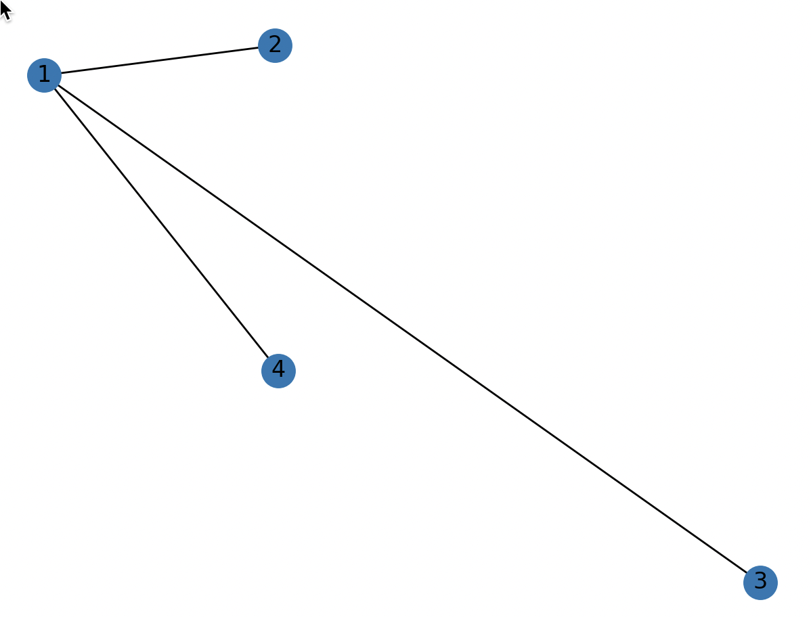
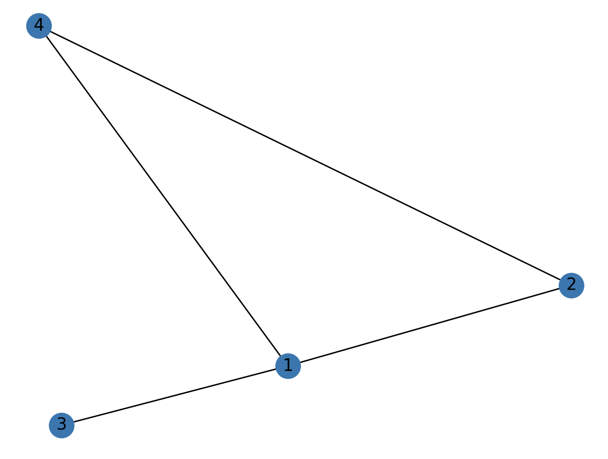

# **graph**

### Design a structure that takes a graph as input and then displays the subgraphs of that graph. (drawing the figure is required)

---

## requirements

you need to have python and pip

```bash
pip install -r requirements.txt
```

### Usage

input graph is in graph.txt

output subgraphs are in subgraphs.txt

after running graph and its subgraphs are shown using networkx

start by

```bash
python3 app.py
```

some sample pictures

<!--   -->

| sample 1                 | image 2                  |
| :----------------------- | :----------------------- |
|  |  |
